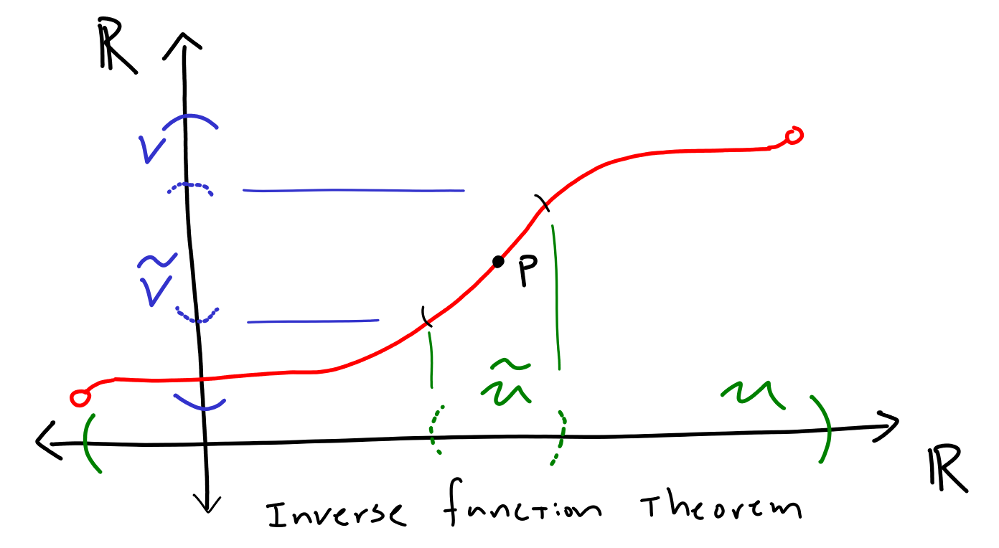
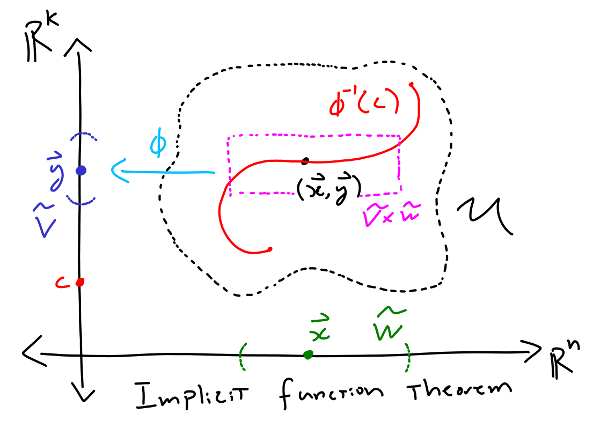

## Calculus

Defs: $C^0, C^1, C^k, C^{\infty}$, *diffeomorphism*, *gradient*, *directional derivative*, *Riemann integral construction*

**Def (differentiable).** Take vector spaces $V,W$, open subset $U \subset V$. Then a function $F: U \to W$ is *differentiable at $p$* if there exists an affine map $L: V \to W$ that is a satisfactory linear approximation in the following sense.
    \\[\lim_{\mathbf{h} \to 0} \frac{\\|F(p+\mathbf{h})-L(p+\mathbf{h})\\|}{\\|\mathbf{h}\\|} = 0\\]

**Prop.** For $F: \mathbb{R}^n \to \mathbb{R}^m$, if the affine linear map $L$ exists in the definition of differentiable, it is unique and can be written $L(p + \mathbf{h}) = F(p) + DF(p)\mathbf{h}$ for some *total derivative* matrix $DF(p)$.

*Note:* The above vector spaces are better thought of as the induced metric spaces in the context of differentiation.

**Def (Jacobi matrix).** In the particular case of $F: \mathbb{R}^n \to \mathbb{R}^m$, if $F$ is differentiable, then partial derivatives at that point exist and the matrix $DF = (\frac{\partial F^i}{\partial x^j})$ is the *Jacobi matrix* or *Jacobian*. 

**Prop.** The Jacobi matrix evaluated at $p$ is the total derivative at $p$.

*Note:* The existence of partial derivatives does not imply differentiable! See Iva's real 2 packet pg. 19. However, we do have the following (also one directional) result.

**Prop.** If all partial derivatives of $F: U \to \mathbb{R}^m$ exist and are continuous (i.e. $F$ is $C^1$), then $F$ is differentiable at every point in $U$.

**Prop (Equality of mixed partial derivatives).** \\[\frac{\partial^2 F^i}{\partial x^j x^k} = \frac{\partial^2 F^i}{\partial x^k x^j}\\]

**Chain Rule.** Given $V,W,X$ vector spaces $U \subset V$, $\widetilde{U} \subset W$ open subsets, $F: U \to \widetilde{U}$ and $G: \widetilde{U} \to X$ we have $D(G \circ F)(p) = DG(F(p))DF(p)$.

**Differentiating under the integral sign.** TODO: Lee Smooth manifolds C.14

**MVT.** $U \subset \mathbb{R}^n$ convex open set, $F: U \to \mathbb{R}^n$ has continuous partial derivatives. Then, for each $P_1, P_2 \in U$, there exists $Q$ such that $F(P_2) - F(P_1) = DF(Q) \cdot \overrightarrow{P_1P_2}$. 

**Taylor's Theorem.** $U \subset \mathbb{R}^n$ open, $f \in C^{k}(U)$, convex $W \subset U$, and $P \in W$, then for $P + \mathbf{h} \in W$ there exists constant $M_k$ depending only on the bounds of the $k$th partial derivatives such that:
* $k=2$ case: $F(P + \mathbf{h}) = F(P) + DF(P)\mathbf{h} + E\_1$ where $\|E\_1\| \leq \frac{1}{2!}M_2 \\|\mathbf{h}\\|^2$.
* $k=3$ case: $F(P + \mathbf{h}) = F(P) + DF(P)\mathbf{h} + \frac{1}{2!} \mathbf{h}^T (\operatorname{Hess} F(P)) \mathbf{h} + E_2$ where $\|E\_2\| \leq \frac{1}{3!}M_3 \\|\mathbf{h}\\|^3$.
* etc. general case is annoying to formulate. See Theorem C.15 in Lee's *Smooth Manifolds*.

*Note matrix $\operatorname{Hess} F := (\frac{\partial^2 F}{\partial x^i \partial x^j})$.*

**Riemann Integral Construction.** Take function $f$ over closed cube $R$. If
\\[\inf\_{\text{ $P$ partition of $R$}} \sum_{Q \in P} \sup f \cdot \operatorname{Vol}(Q) = \sup\_{\text{ $P$ partition of $R$}} \sum_{Q \in P} \inf f \cdot \operatorname{Vol}(Q)\\]
Then $f$ is *Riemann integrable* over $R$ and the *Riemann integral* $\int_R f dV$ denotes this common value.

*Note: In words, we require that choosing the lowest value of $f$ or the highest value of $f$ in the Riemann sum approach the same value in the limit.*

*Note: The above definition easily extends to taking an integral over any bounded set by taking sufficiently large curve and multiplying by the indicator function. Furthermore, taking the integral of only an indicator function can provide a notion of volume.*

*Note: Integral of vector valued function is vector given by integral of components*

**Prop (Lebesgue's Irreducibility Criterion).** A set of discontinuities of $f$ over cube $A$ has measure $0$ if and only if $f$ is Riemann integrable.

**Prop C.21** Continuous functionals are integrable over sets bounded sets with measure zero boundary.

**Theorem C.26 (Change of variables).** Can change variables under an integral by multiplying a stretch factor given by the determinant of the Jacobi matrix.

**Theorem C.27 (Fubini's Theorem).** TODO

**Inverse Function Theorem.** $F: U \to V$ smooth function between open sets of $\mathbb{R}^n$. If $DF(p)$ invertible for $p \in U$, then there exist connected neighborhoods $\widetilde{U} \subset U$ and $\widetilde{V} \subset V$ such that the restriction $F: \widetilde{U} \to \widetilde{V}$ is a diffeomorphism.

*Note: The following implicit function theorem gives condition under which the level set of a smooth function is a graph of a smooth function.*

**Implicit Function Theorem.** Assume open $U \subset \mathbb{R}^n \times \mathbb{R}^k$, smooth $\phi: U \to \mathbb{R}^k$, points $(\mathbf{x}, \mathbf{y}) \in U$ and $c = \phi((\mathbf{x}, \mathbf{y}))$ and $D(\phi\|\_{\mathbf{x}})(\mathbf{y})$ is invertible. Then there exists neighborhoods $\widetilde{V} \subset \mathbb{R}^n$ of $\mathbf{x}$ and $\widetilde{W} \subset \mathbb{R}^k$ of $\mathbf{y}$ together with smooth function $F: \widetilde{V} \to \widetilde{W}$ such that $\varphi^{-1}(c) \cap (\widetilde{V} \times \widetilde{W})$ is the graph of $F$.

*Note: We will have $\phi\|\_{\mathbf{x}}: \widetilde{U} \to \mathbb{R}^k$ for $\widetilde{U} \subset \mathbb{R}^k$, so $D(\phi\|\_{\mathbf{x}})(\mathbf{y})$ represents the corresponding $k \times k$ Jacobi matrix.*

